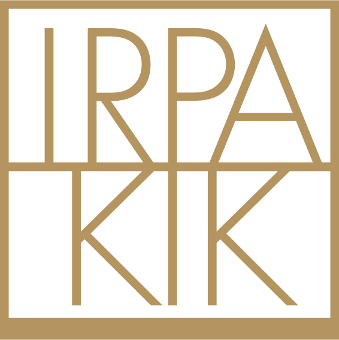
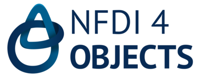

# Project Team & Acknowledgements

## Core Project Team

- **Joseph Padfield**  
  [National Gallery, London](https://www.nationalgallery.org.uk/)  
  <a href="https://orcid.org/0000-0002-2572-6428" target="_blank" title="ORCID profile">
    
    ORCID: 0000-0002-2572-6428
  </a>

- **Wim Fremout**  
  [Royal Institute for Cultural Heritage (KIK-IRPA), Brussels](https://www.kikirpa.be/)  
  <a href="https://orcid.org/0000-0002-1684-377X" target="_blank" title="ORCID profile">
    
    ORCID: 0000-0002-1684-377X
  </a>

- **Sophia Sotiropoulou**  
  [Foundation for Research and Technology – Hellas (FORTH)](https://www.forth.gr/)  
  <a href="https://orcid.org/0000-0001-9146-8474" target="_blank" title="ORCID profile">
    
    ORCID: 0000-0001-9146-8474
  </a>

- **Yiu-Kang Hsu**  
  [Deutsches Bergbau-Museum Bochum](https://www.bergbaumuseum.de/)  
  <a href="https://orcid.org/0000-0002-2439-4863" target="_blank" title="ORCID profile">
    
    ORCID: 0000-0002-2439-4863
  </a>

## Acknowledgement

This project was setup as part of the work of the following projects:

### The Horizon Europe [E-RIHS IP](https://www.e-rihs.eu/the-project/) project

 

- [E-RIHS IP has received funding from the European Union’s Horizon Europe call HORIZON-INFRA-2021-DEV-02, Grant Agreement n.101079148.](https://cordis.europa.eu/project/id/101079148)

### The Horizon Europe [ECHOES](https://www.echoes-eccch.eu/) project

 

- [ECHOES is a project funded by the European Commission under Grant Agreement n.101157364 – ECHOES.](https://cordis.europa.eu/project/id/101157364)
- [ECHOES is a project funded by UK Research and Innovation (UKRI) under the UK government’s Horizon Europe funding guarantee n.10110142 & n.10110466.]()

### The [UKRI RICHeS](https://www.riches.ukri.org/) [HSDS](https://hsds.ac.uk/) project

 

- [HSDS is a project funded by UK Research and Innovation (UKRI) as part of the RICHeS Programme.](https://www.riches.ukri.org/)

### The [H-SEARCH](https://rdm.kikirpa.be/projects/h-search/) project

 

- [H-SEARCH is a project funded by the Belgian Science Policy Office (BELSPO) as part of the IMPULS INFRA Programme, grant number IM/RT/23/H-SEARCH.](https://www.belspo.be/)

### [NFDI4Objects](https://www.nfdi4objects.net/) project

 

- [NFDI4Objects is funded by Deutsche Forschungsgemeinschaft (DFG) as a consortium of the national research data infrastructure (NFDI) in Germany, project number 50183640](https://gepris.dfg.de/gepris/projekt/501836407?context=projekt&task=showDetail&id=50183640)
