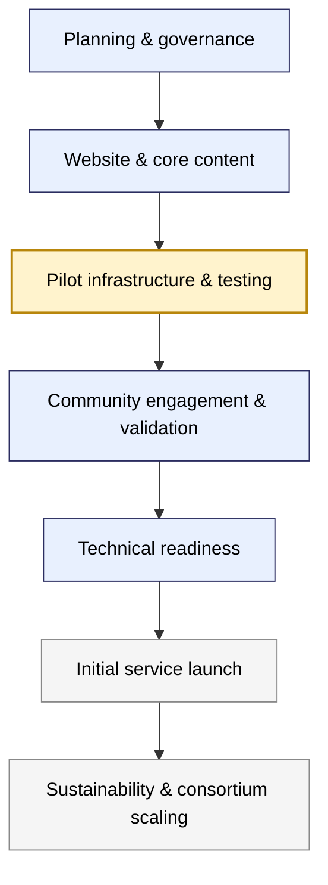

---
hide:
  - toc
---

# Roadmap

The Heritage Samples Registry is being developed in a series of phased steps, moving from initial planning and pilot testing through to a sustainable, community-supported service.

---

**See also:**  
- [News & Updates](../news.md)  
- [Consortium Vision](consortium-vision.md)
